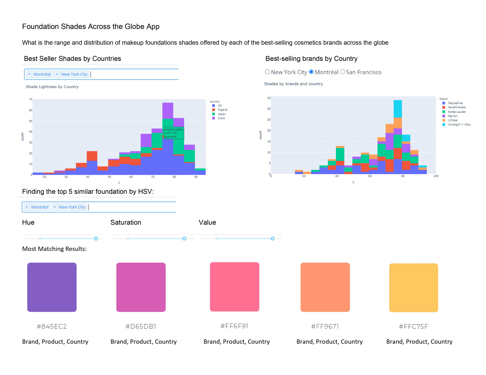
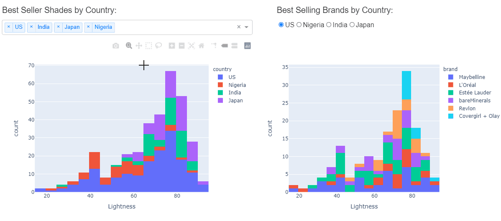
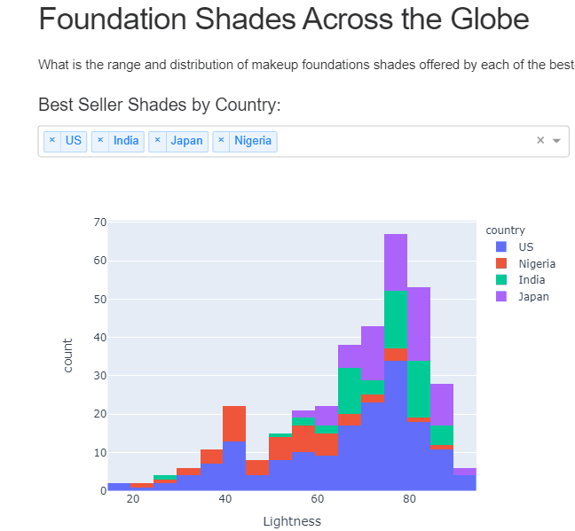
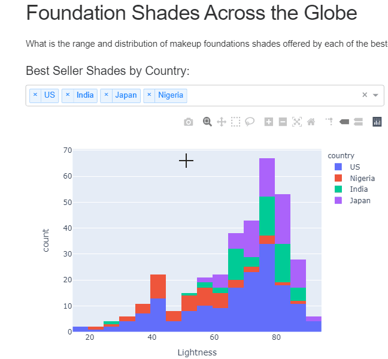
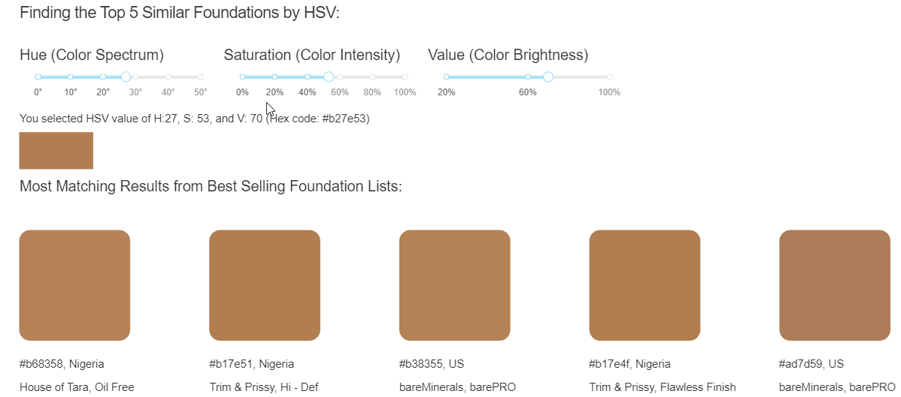

# Foundation Shades Across the Globe App 

-   App link: https://foundation-product-dashboard.herokuapp.com/

-   Author: Ela Bandari, Ling (Elina) Lin, Kangbo Lu, Rachel Xu

## Description of the app
This interactive app consists of visualization charts (histograms and color cards) that display the shades (based on lightness) in global best-selling foundation products of different beauty brands around the world. The filters on the top allow users to compare shade distributions by countries and by brands offered in a particular country. On the top charts, users can select the category legends underneath to focus on only one shade distribution, or zoom in on the distributions to closely examine a particular range of shades. There are also customizable sliders in the bottom for users to specify ranges of variables (brightness, hue and saturation), and the app will return the top 5 similar shades available in the specified market based on filter. Both distributions and search results will be updated automatically when changing the filters or sliders. 

## Dashboad Sketch Design 

## Implementation and User Guide
#### *1. Filter foundation lightness histograms by country:*  

#### *2. Single or double click on legend to filter categories:*  

#### *3. Use your mouse to select regions:*  

#### *4. Use foundation HSV value slider to find matching products by color:*  

